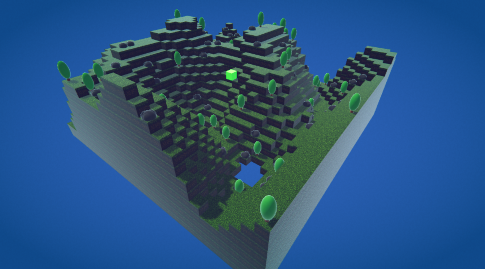

# 🟫 Block Terrain Generator

**Block Terrain Generator** is a free, open-source terrain generation tool built in **Unity 6** by [Oneak](https://realmmadness.com/oneak).  
It lets you quickly create and experiment with block-style environments for your Unity projects, ideal for prototyping

✨ This project also has a full-featured version for supporters on Patreon
🧩 Includes Unity Package with:
🎛️ GUI terrain controls (size, noise, water, seed)
💾 Save/load world codes
🌍 Infinite chunk generation with adjustable render distance
Check it out here [Procedural Block Terrain in Unity](https://www.patreon.com/posts/procedural-block-132631336?utm_medium=clipboard_copy&utm_source=copyLink&utm_campaign=postshare_creator&utm_content=join_link)

Want to generate texture atlases with Python? Grab the script from my repo: [Texture Atlas Generator](https://github.com/oneak/Code-Collection/tree/main/Python/Generators/Texture%20Atlas%20Generator)

## ✨ Features
- Procedural block terrain generation
- Built for Unity 6 with Universal Render Pipeline (URP) for maximum compatibility
- Fully commented and beginner-friendly code

## 🆓 Usage & License

You are **free to use, modify, and improve** this terrain generator in any way you like.  
Make it your own, contribute back, or use it as a learning resource!

- **No restrictions:** Use in personal, educational, or commercial projects
- **Attribution appreciated:** Please credit **oneak** if you use or share this tool

## 🛠️ How to Use: Quick Start Guide

Follow these steps to get your block terrain up and running in Unity

1. **Copy or Clone the Folder**  
   - Copy the `Block Terrain Generator` folder into your Unity project's `Assets` directory

2. **Create an Empty GameObject**  
   - In your Unity scene, right-click in the Hierarchy and select **Create Empty** 
   - Rename it (for example, `BlockTerrainGenerator`)

3. **Add the Script**  
   - Drag the `BlockTerrainGenerator.cs` script from your project onto the empty GameObject you just created
   - Assign the `Material` in BlockTerrainGenerator Component
   - Assign `Texture.png` to the material’s Albedo (Base Map)

6. **(Optional) Add Decoration Prefabs**  
   - If you want trees or rocks, create prefabs for them and assign them to the `Tree Prefab` and `Rock Prefab` fields

7. **(Optional) Add a Player**  
   - Assign a player prefab to the `Player Prefab` field, or leave it empty for a terrain-only scene

8. **Play!**  
   - Hit the **Play** button in Unity
   - The script will generate a blocky terrain based on your settings
   - Press `R` to generate terrain again

---

**Made with ❤️ by [Oneak](https://realmmadness.com/oneak) – part of the [Code Collection](../../README.md)**

**License:** [GNU GPL v2](https://www.gnu.org/licenses/old-licenses/gpl-2.0.html)